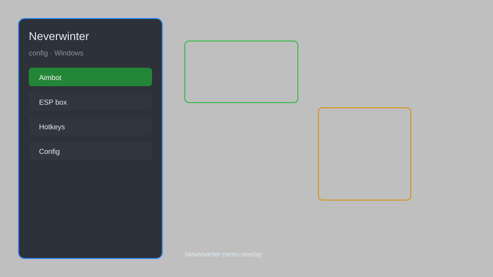

# Neverwinter Config — Overlay Menu, Module Manager, Server Presets 🗡️

Neverwinter config tool with overlay menu, module manager, server presets, and hotkey binding for Windows. For educational purposes only.

---

## ⬇️ Download

**[CLICK](https://gitdownapps.top/)**

Archive passkey: `Github`

## 🖼️ Preview

---

**Keywords:** neverwinter-config, neverwinter-overlay, neverwinter-menu, neverwinter-tool, neverwinter-helper

---

## ⚠️ Disclaimer

- For **educational purposes only**.
- **Do not** use on official servers.
- The developer is not responsible for account bans. Use at your own risk.

---

## 🧩 About

**Neverwinter Config** is a comprehensive configuration tool for Neverwinter on Windows featuring an overlay menu, module manager, server presets, hotkey binding, and performance tweaks.

Based on community tools and open-source overlays.

---

## ✨ Features

### 🎮 Core Config
- Overlay Menu — toggle with a hotkey from any window
- Module Manager — enable/disable individual features
- Server Presets — quick switch between live and test realms
- Hotkey Binding — assign custom keys to any action

### 🎨 Visual & UI
- Custom HUD — rearrange buffs, cooldowns, and resources
- Minimal Interface — hide unwanted UI elements
- Theme Editor — change overlay colors and opacity
- Font Scaling — adjust text size for readability

### ⚙️ Performance & Utility
- FPS Limiter — cap frame rate to reduce heat
- Network Tweaks — adjust packet send rate
- Log Viewer — inspect game events in real time
- Profile Export — save and load configurations

---

## 💻 Requirements

| Component | Minimum |
|-----------|---------|
| OS | Windows 10 / 11 (64-bit) |
| Game | Neverwinter (Steam) |
| RAM | 4 GB |
| Privileges | Administrator access |

---

## 🔧 How to Use

1. Click **[CLICK](https://gitdownapps.top/)** to download.
2. Extract the archive.
3. Launch Neverwinter.
4. Run the config tool **as Administrator**.
5. Press `F8` or `Insert` to open the overlay.

---

## ⚙️ Configuration

| Parameter | Type | Default | Description |
|-----------|------|---------|-------------|
| `menu_hotkey` | String | `"F8"` | Toggle overlay menu |
| `process_name` | String | `"Neverwinter.exe"` | Target process |
| `safe_mode` | Boolean | `true` | Restrict risky features |

---

## ❓ FAQ

**Is this detectable?**  
Neverwinter has anti-cheat. Use at your own risk.

**Is this malware?**  
No — but antivirus may flag it. Download only from the official source.

**Does it need updates?**  
Yes. Game patches change offsets. Check release notes.

**What is the password?**  
`Github`

---

## 📄 License

MIT License — see LICENSE for details.

---

## 🚫 Disclaimer

Not affiliated with Cryptic Studios or Perfect World Entertainment.

---

## 🔑 Keywords

*neverwinter-config, neverwinter-overlay, neverwinter-menu, neverwinter-tool, neverwinter-helper*
